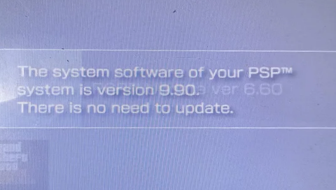

# spoofix

  

  
spoofix is a PSP homebrew that fixes the "The system version of your PSP™ system version is 9.90. There is no need to update" issue on 5.50 GEN-D firmwares. This homebrew program basically backs up your system's verison.txt to your Memory Stick, then replaces the system's version.txt with the unspoofed one. This allows you to unspoof your firmware from 9.90 to 5.50 so you can update your PSP without any issues.   

  

  
It also has a backup detection so if anything goes wrong for some reason you can just rerun the program. The program will automatically replace the system's unspoofed version.txt with your old one.  
The program was tested many times on my PSP 1003 running the 5.50 GEN-D3 & 6.61 PRO-C2 firmware.
